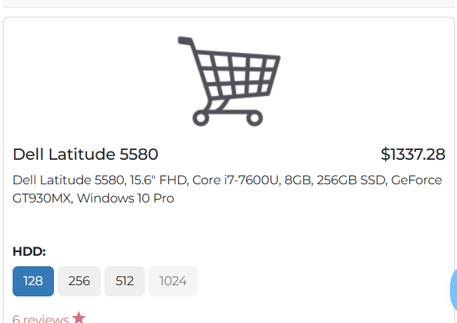
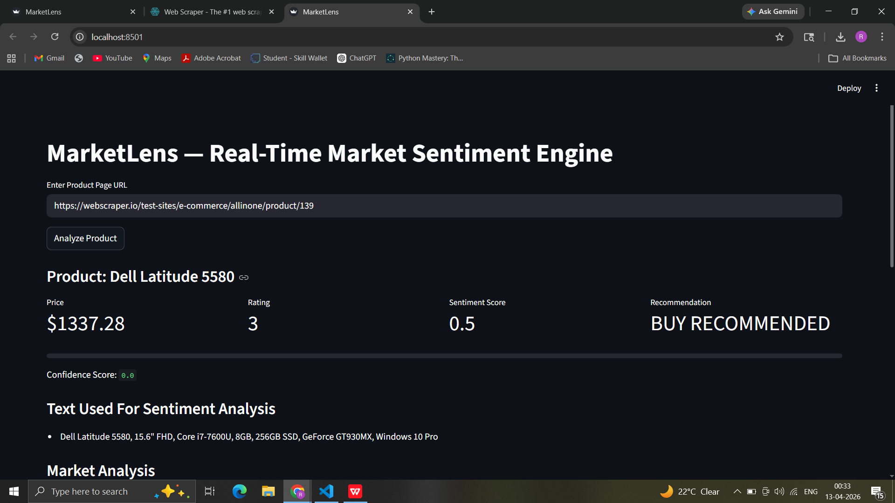

# MarketLens — Real-Time Market Sentiment Engine

MarketLens is a web-based data analysis tool that scrapes product information from e-commerce websites and analyzes customer sentiment to generate purchase recommendations.

The system extracts product price, rating, and descriptive text from product pages, applies Natural Language Processing (NLP) to determine sentiment, and stores historical results in a MySQL database for visualization.

---

## Features

• Web scraping of product pages  
• Automatic extraction of product name, price, and rating  
• Sentiment analysis using TextBlob NLP  
• Decision engine for BUY / HOLD / DO NOT BUY recommendation  
• MySQL database storage for historical tracking  
• Interactive dashboard built with Streamlit  
• Graph visualization for market analysis  

---

## System Architecture

```
Product URL
     ↓
Web Scraper (BeautifulSoup)
     ↓
Extract:
• Product Name
• Price
• Rating
• Description / Reviews
     ↓
Sentiment Analysis (TextBlob NLP)
     ↓
Decision Engine
     ↓
MySQL Database Storage
     ↓
Streamlit Dashboard Visualization
```

---

## Technologies Used

| Technology | Purpose |
|------|------|
Python | Core programming language |
Streamlit | Web dashboard |
BeautifulSoup | Web scraping |
Requests | HTTP requests |
TextBlob | Sentiment analysis |
MySQL | Data storage |
Matplotlib | Data visualization |
Pandas | Data processing |

---

## Sentiment Analysis Method

The system uses the **TextBlob Natural Language Processing library** to evaluate sentiment.

TextBlob calculates **polarity scores ranging from -1 to +1**:

| Score | Meaning |
|------|------|
-1 | Very Negative |
0 | Neutral |
+1 | Very Positive |

The system averages sentiment across multiple pieces of text extracted from the product page.

The score is then normalized to a **0–1 scale**.

---

## Decision Engine

The recommendation is calculated using a weighted scoring system:

```
Score = (Sentiment × 0.7) + (Rating × 0.3)
```

Decision rules:

| Score Range | Recommendation |
|------|------|
> 0.5 | BUY RECOMMENDED |
0.2 – 0.5 | HOLD |
< 0.2 | DO NOT BUY |

---

## Graph Analysis

### Sentiment Trend Over Time

Shows how sentiment scores evolve across multiple product analyses stored in the database.

### Price vs Sentiment

Visualizes the relationship between product pricing and customer sentiment.

---

## Database Schema

```
product_analysis

id INT AUTO_INCREMENT PRIMARY KEY
product_name TEXT
price FLOAT
rating FLOAT
sentiment_score FLOAT
decision TEXT
analysis_time TIMESTAMP
```

---

## Running the Project

Install dependencies:

```
pip install -r requirements.txt
```

Run the application:

```
streamlit run app.py
```

---

## Example Workflow

1. Enter product URL
2. System scrapes product data
3. Text is analyzed for sentiment
4. Recommendation is generated
5. Result stored in MySQL
6. Dashboard displays analytics graphs

---
## Demo


## Future Improvements

• Scrape real product reviews instead of description text  
• Support multiple e-commerce platforms  
• Implement machine learning sentiment models  
• Add price tracking alerts  

---

## Author

Developed as a data analysis and NLP project demonstrating automated market sentiment evaluation.